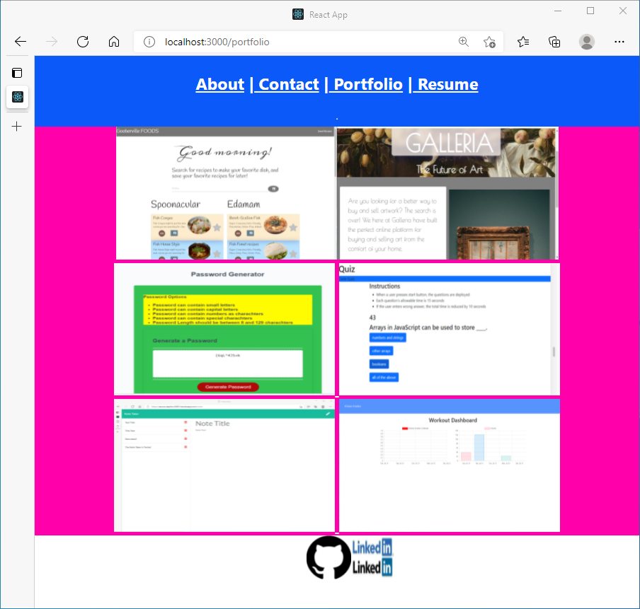

# react-portfolio
1. Built About ME, header, porfolio, Contact, footer and resume compomets files
2. Added projects and class homeworks' screenshots (Six of them)
3. Built functionality of checking valid  email entry under contact in Navbar.
4. Navbar is added in header.
5. Added my picture in About Me component file.
6. Links to github repos are added.
7. Also, added github and Linkedin icons in the footer.
8. The following is the screenshot of react-portfolio.

/img">